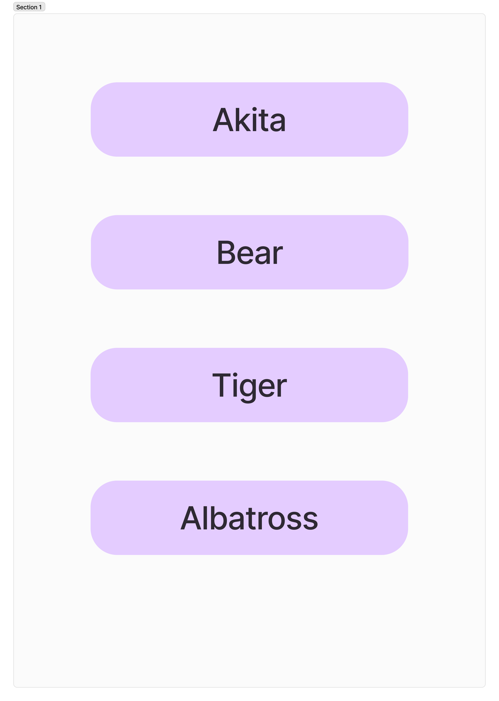
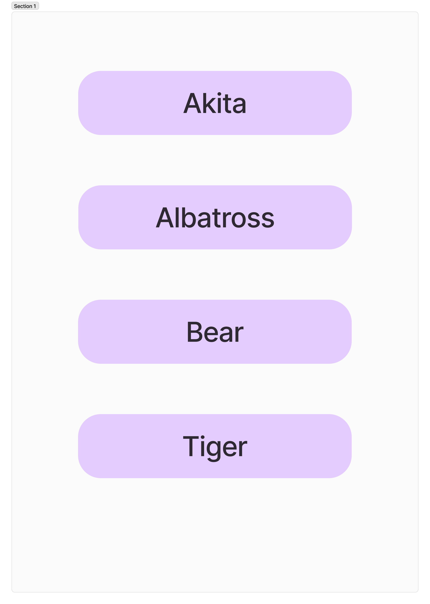
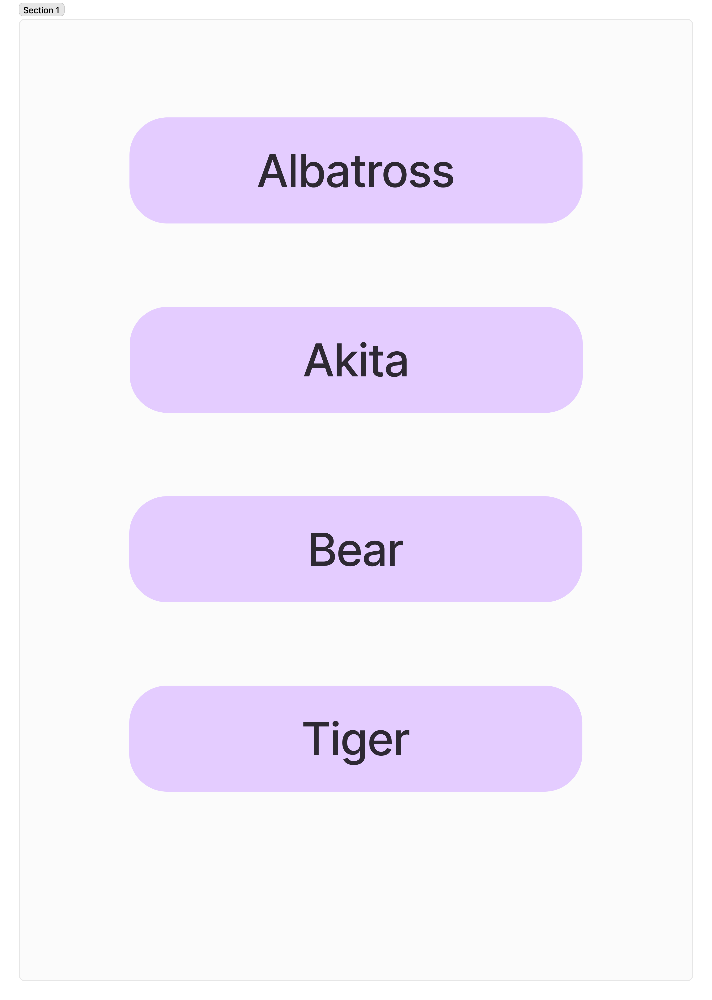
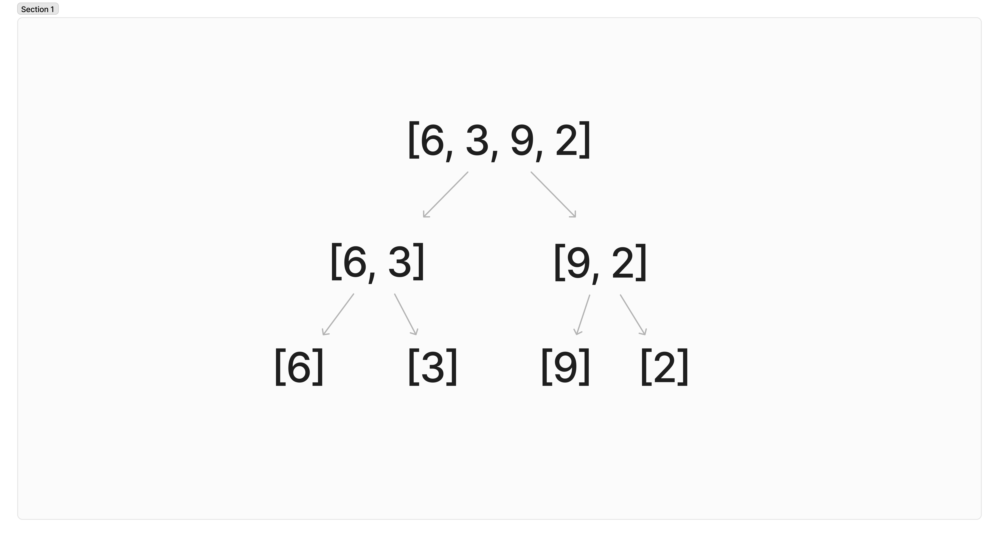

# 4. 정렬 알고리즘

## 4-1. 버블 정렬

숫자 리스트를 순회하면서 각 숫자를 다음 숫자와 비교하고, 순서가 올바르지 않으면 둘의 위치를 바꾸는 정렬 알고리즘

액체 속에서 공기 방울이 올라가는 것처럼 보인다고 해서 버블 정렬이라함

```python
# 오름차순 정렬
[32, 1, 9, 6] # 32와 1를 비교하면 32가 크기 때문에 서로의 위치를 바꿈
[1, 32, 9, 6] # 32와 9를 비교하면 32가 크기 때문에 서로의 위치를 바꿈
[1, 9, 32, 6] # 32와 6을 비교하면 32가 크기 때문에 서로의 위치를 바꿈
[1, 9, 6, 32] # 1은 9보다 작기 때문에 아무 일도 일어나지 않음
# 9와 6은 9가 크기 때문에 서로의 위치를 바꿈
[1, 6, 9, 32]
```

버블 정렬에서는 알고리즘이 첫 번째 단계를 끝냈을 때 가장 큰 숫자가 리스트의 마지막으로 이동

만약 가장 작은 숫자가 리스트의 맨 마지막에 있는 상태로 정렬을 시작한다면 이 숫자가 리스트의 처음으로 이동하기 위해 여러 번의 단계를 거쳐야 할 것임

```python
def bubble_sort(a_list):
		list_length = len(a_list) - 1
		for i in range(list_length):
				# 내부에 있는 for 루프에서는 if 문으로 현재 숫자와 다음 숫자 비교
				for j in range(list_length):
						if a_list[j] > a_list[j+1]:
								a_list[j], a_list[j+1] = a_list[j+1], a_list[j]
		return a_list # [1, 9, 6, 32]
```

내부 루프만 있다면 알고리즘은 조기 종료되고, 리스트는 완전히 정렬되지 않음

내부 루프에서 i를 빼는 형태로 바꾸면 버블 정렬 알고리즘의 효율을 조금 더 높일 수 있음

```python
def bubble_sort(a_list):
		list_length = len(a_list) - 1
		for i in range(list_length):
				for j in range(list_length - i):
						if a_list[j] > a_list[j+1]:
								a_list[j], a_list[j + 1] = a_list[j + 1], a_list[j]
		return a_list
```

내부 루프에서 마지막 숫자의 비교를 생략하는 이유는 리스트가 이미 그만큼 정렬됐기 때문임

첫 번째 반복이 끝나자 숫자 32가 리스트의 끝으로 이동함

내부 루프에서 한 번 거치면 가장 큰 숫자가 리스트 마지막으로 이동하고, 두 번 거치면 두 번째로 큰 숫자가 마지막에서 두 번째 위치로 이동함

다른 숫자와 비교할 필요가 없으므로 루프를 일찍 종료해도 안전한 것

```python
def bubble_sort(a_list):
		list_length = len(a_list) - 1
		for i in range(list_length):
				no_swaps = True
				for j in range(list_length - i):
						if a_list[j] > a_list[j + 1]:
								a_list[j], a_list[j+1] = a_list[j+1], a_list[j]
								no_swaps = False
						if no_swaps:
								return a_list
		return a_list
```

내부 루프를 시작할 때 no_swaps를 True로 초기화하고, 내부 루프를 진행하면서 숫자의 위치를 바꿨다면 False로 값을 바꿈

내부 루프를 끝까지 진행하고도 no_swaps가 True라면 리스트가 정렬된 것이므로 알고리즘을 끝내도 됨

리스트가 거의 정렬된 상태로 정렬을 시작하면 버블 정렬에 필요한 시간을 상당히 아뀔 수 있음

## 4-2. 버블 정렬을 사용해야 할 때

버블 정렬의 장점은 알고리즘이 단순한 편이어서 정렬 알고리즘을 배우기 시작하는 출발점으로 삼기 적합함

버블 정렬은 두 번 중첩된 for 루프에 의존하므로 알고리즘의 시간 복잡도는 O(n**2)임

데이터 세트가 작으면 버블 정렬도 괜찮지만 데이터 세트가 크면 효율적인 선택이 아님

버블 정렬은 안정적임. 안정적인 정렬이란 정렬 기준 이외의 요인 때문에 리스트의 순서가 바뀌지 않는다는 의미 

예를 들어 네 가지 동물 이름이 데이터베이스의 레코드에 들어 있다고 하자



단어의 첫 글자를 기준으로 레코드를 정렬한다면 다음과 같이 정렬될 것이다.

**안정적인 배열**



A로 시작하는 두 단어, Akita와 Albatross를 봤을 때 Akita의 뒤에 Albatross가 위치하는 기존의 순서를 그대로 유지했기 때문이다. 반면 불안정한 정렬에서는 정렬의 기준으로 정한 A로 시작하는 동물의 이름이라는 기준 이외의 다른 요인에 의해 기존의 순서와 달라질 수 있다. 기존에는 Akita가 Albatross보다 앞에 위치하지만 불안정한 정렬을 마치고 나서는 Albatross가 Akita보다 앞에 위치할 수 도 있다는 뜻이다. 

**불안정한 정렬**



즉, 안정적인 정렬에서는 정렬의 기준에만 맞으면 원래의 순서를 유지한다. 

버블 정렬은 안정적이지만 $O(n^2)$을 따르기 때문에 더 효율적인 정렬 알고리즘에 밀려 잘 활용하지 않는다.

# 4-3. 삽입 정렬

**삽입 정렬(Insertion Sort)**은 카드 묶음을 정렬하는 것과 비슷한 정렬 알고리즘이다. 먼저 카드 묶음을 둘로 나눈다. 왼쪽에는 정렬된 카드들이 있고, 오른쪽에는 정렬되지 않는 카드들이 있다. 오른쪽에 있는 카드를 하나씩 꺼내 정렬 규칙에 따라 왼쪽에 정렬된 카드들 사이에 ‘삽입’한다. 이를 반복하면 오른쪽에 있는 모든 카드가 정렬되어 있던 왼쪽 카드들 사이의 올바른 위치에 정렬된 것이다.

다음과 같이 네 개의 숫자로 구성된 리스트를 삽입 정렬로 정렬해 보겠다. 이 알고리즘은 리스트의 두 번째 요소인 5에서 시작한다.

```python
[6, 5, 8, 2]
```

현재 숫자를 이전 숫자와 비교한다. 6이 5보다 크므로 위치를 바꾼다.

```python
[5, 6, 8, 2]
```

이제 리스트의 왼쪽 절반은 정렬됐고, 오른쪽은 정렬되지 않았다.

```python
[5, 6, 8, 2]
```

정렬되지 않은 오른쪽에 있는 숫자들 중 첫 번째, 즉 리스트의 세 번째 숫자를 이전 숫자와 비교한다. 8이 6보다 크므로 6과 8의 위치는 바뀌지 않는다.

```python
[5, 6, 8, 2]
```

왼쪽에 있는 수자는 이미 정렬됐으므로 8과 5를 비교할 필요가 없다.

```python
[5, 6, 8, 2]
```

다음에는 8과 2를 비교한다.

```python
[5, 6, 8, 2]
```

8이 2보다 크므로 8과 2의 위치를 바꾸고, 정렬된 왼쪽 절반의 리스트와 2를 하나씩 확인한다. 비교를 반복한 2가 리스트의 맨 앞으로 이동해 전체 리스트가 정렬될 때까지 반복한다.

```python
[5, 6, 2, 8]
[5, 2, 6, 8]
[2, 5, 6, 8]
```

다음은 파이썬에서 삽입 정렬 알고리즘을 구현한 코드이다.

```python
def insertion_sort(a_list):
	for i in range(1,len(a_list)):
		value = a_list[i]
		while i > 0 and a_list[i-1] > value:
			a_list[i] = a_list[i-1]
			i = i - 1
		a_list[i] = value
	return a_list
```

먼저 숫자 리스트 `a_list`를 매개변수로 받는 insertion_sort 함수를 정의한다.

```python
def insertion_sort(a_list):
```

이 함수는 for 루프를 사용해 각 요소를 하나씩 비교한다. 그리고 while 루프를 사용해 정렬된 왼쪽 절반의 어느 위치에 숫자를 삽입할지 결정한다.

```python
for i in range(1, len(a_list)):
	···
	while i > 0 and a_list[i-1] > value:
		···
```

for 루프는 리스트의 두 번째 요소인 인덱스 1에서 시작한다. 그리고 현재 숫자를 value 변수에 저장한다.

```python
for i in range(1, len(a_list)):
	value = a_list[i]
```

while 루프는 정렬되지 않은 오른쪽에서 꺼낸 요소를 정렬된 왼쪽으로 옮긴다. 이 과정은 i가 0보다 크고, 리스트의 ‘이전’ 요소가 value에 저장한 ‘다음’요소보다 크면(즉, 정렬되지 않았다면) 루프를 계속 반복한다. i가 0보다 크다는 조건이 필요한 이유는 두 개의 숫자를 비교하는 while 루프에서 i가 0이라면 리스트의 첫 번째 요소이므로 비교할 대상이 없기 때문이다.

```python
while i > 0 and a_list[i-1] > value:
```

while 루프는 value에 저장한 숫자가 리스트의 이전 요소보다 더 작을 때만 실행되며, while 루프에서는 더 큰 숫자를 리스트의 오른쪽으로 옮긴다. 그 다음에는 정렬된 왼쪽의 어디에 숫자를 삽입할지 결정한다. i를 1씩 줄이면서 왼쪽에 있는 숫자들과 비교해 위치를 결정하게 된다.

```python
while i > 0 and a_list[i-1] > value:
	a_list[i] = a_list[i-1]
	i = i - 1
```

while 루프가 끝나면 value에 저장된 현재 숫자를 앞에서 결정한 위치에 삽입한다.

```python
a_list[i] = value
```

이제 삽입 정렬 알고리즘이 다음의 리스트를 어떻게 정렬하는지 한 단계씩 살펴보자.

```python
[6,5,8,2]
```

for 루프를 처음 실행할 때의 i는 1이고, value는 5이다.

```python
for i in range(1, len(a_list)):
	value = a_list[i]
```

i인 1은 0보다 크고, 그 값인 5는 6보다 작으므로 다음의 테두리로 강조된 부분이 True로 평가되어 while 루프가 실행된다.

```python
while i > 0 and a_list[i-1] > value:
	a_list[i] = a_list[i-1]
	i = i - 1
a_list[i] = value
```

while 루프가 실행되고, 두 번째 행이 있는 다음 코드는

```python
while i > 0 and a_list[i-1] > value:
	a_list[i] = a_list[i-1]
	i = i - 1
a_list[i] = value
```

```python
[6,5,8,2]
```

```python
[6,6,8,2]
```

그 다음 코드는 i를 1만큼 줄인다.

```python
while i > 0 and a_list[i-1] > value:
	a_list[i] = a_list[i-1]
	i = i - 1
a_list[i] = value
```

i가 0이 되었으므로 while 루프가 종료된다.

```python
while i > 0 and a_list[i-1] > value:
	a_list[i] = a_list[i-1]
	i = i - 1
a_list[i] = value
```

그 다음 코드를 실행한다.

```python
while i > 0 and a_list[i-1] > value:
	a_list[i] = a_list[i-1]
	i = i - 1
a_list[i] = value
```

이전의 리스트를 아래와 같이 바꾼다.

```python
[6,6,8,2]
```

```python
[5,6,8,2]
```

이렇게 리스트의 첫 번쨰와 두 번째 요소를 정렬했다. 이제 알고리즘은 같은 과정을 반복해 8과 2가 들어 있는 오른쪽을 마저 정렬한 것이다.

# 4-4. 삽입 정렬을 사용해야 할 때

삽입 정렬은 버블 정렬과 마찬가지로 안정적이다. 또한 똑같이 시간 복잡도 $O(n^2)$을 따르므로 아주 효율적이지 않은 것도 버블 정렬과 같다. 하지만 실무에서는 삽입 정렬은 사용해도 버블 정렬은 사용하지 않는다. 정렬되어 있거나 거의 정렬된 리스트에서 삽입 정렬의 시간 복잡도는 $O(n)$으로 아주 효율적이지만, 버블 정렬의 시간 복잡도는 여전히 $O(n^2)$이므로 리스트의 상태와 무관하게 비효율적이기 때문이다.

다음과 같은 리스트가 있다고 하자.

```python
[1, 2, 3, 4, 5, 7, 6]
```

마지막 두 개를 제외하면 이 리스트의 숫자들은 모두 정렬된 상태이다. 삽입 정렬의 while 루프는 두 숫자의 순서가 바르지 않을 때만 실행되므로 이렇게 거의 정렬된 리스트를 삽입 정렬로 정렬할 때는 while 루프가 단 한 번 실행되어 여덟 단계만 거치면 된다. 두 번째 루프가 한 번만 실행되므로 이 리스트의 시간 복잡도는 선형이다.

# 4-5. 병합 정렬

병합 정렬(Merge Sort)이란 리스트를 계속해서 반으로 나눠 요소가 한 개뿐인 리스트로만 남았을 때, 이들을 올바른 순서대로 다시 합치는 재귀 정렬 알고리즘이다. 병합 정렬은 다음의 [그림 4-1]처럼 원래 리스트가 한 개의 숫자로만 이뤄진 서브 리스트들도 나뉠 때까지 분할을 계속한다.



요소가 하나뿐이라면 리스트가 정렬된 상태라고 할 수 있으므로 병합 정렬의 다음 단계는 요소가 하나만 있는 정렬된 리스트들이 첫 번째 요소를 비교하여 하나씩 병합하는 것이다. 여기서 병합은 리스트들을 정렬한 순서대로 합친다는 뜻이다.

먼저 [6]과 [3]을 병합하고 다음에는 [9]와 [2]를 병합한다. 각 리스트에는 하나의 숫자만 있으므로 두 숫자를 비교해 더 작은 숫자를 새로 병합된 리스트의 처음 위치에 놓는다. 이제 두 개의 정렬된 리스트가 생겼다.

```python
[3,6] , [2,9]
```

이제 리스트 두 개를 병합할 차례이다.

```python
# 병합 전
[3, 6], [2, 9]

# 병합 후
[]
```

먼저 두 리스트의 첫 번째 요소인 3과 2를 비교한다. 2가 더 작으므로 새로운 병합 리스트에 들어간다.

```python
# 병합 전
[3,6], [9]

# 병합 후 
[2]
```

이제 3과 9를 비교한다. [3, 6]은 정렬된 상태이고, 3이 더 작으므로 병합 리스트에 들어간다.

```python
# 병합 전
[6], [9]

# 병합 후
[2,3]
```

마지막으로 6과 9르 비교한다. 6이 더 작으므로 병합 리스트에 넣고, 그 다음 9도 마저 넣는다.

```python
# 병합 전
[], []

# 병합 후
[2, 3, 6, 9]
```

병합을 모두 끝내고 정렬된 리스트 하나만 남았다.

다음은 파이썬에서 병합 정렬을 구현한 코드이다.

```python
def merge_sort(a_list):
	if len(a_list) > 1:
		mid = len(a_list) // 2
		left_half = a_list[:mid]
		right_half = a_list[mid:]
		merge_sort(left_half)
		merge_sort(right_half)
		
		left_ind = 0
		right_ind = 0
		alist_ind = 0
		while left_ind < len(left_half) and right_ind < len(right_half):
			if left_half[left_ind] <= right_half[right_ind]:
				a_list[alist_ind] = left_half[left_ind]
				left_ind += 1
			else:
				a_list[a_list_ind] = right_half[right_ind]
				right_ind +=1
			alist_ind +=1
			
		while left_ind < len(left_half):
			a_list[alist_ind] = left_half[left_ind]
			left_ind += 1
			alist_ind += 1
		
		while right_ind < len(right_half):
			a_list[alist_ind] = right_half[right_ind]
			right_ind += 1
			alist_ind += 1
```

리스트를 서브 리스트로 분할하는 부분은 2행에서 7행의 코드이다.

```python
	if len(a_list) > 1:
		mid = len(a_list) // 2
		left_half = a_list[:mid]
		right_half = a_list[mid:]
		merge_sort(left_half)
		merge_sort(right_half)
```

나머지는 리스트를 병합하는 부분에 해당한다.

```python
		left_ind = 0
		right_ind = 0
		alist_ind = 0
		while left_ind < len(left_half) and right_ind < len(right_half):
			if left_half[left_ind] <= right_half[right_ind]:
				a_list[alist_ind] = left_half[left_ind]
				left_ind += 1
			else:
				a_list[a_list_ind] = right_half[right_ind]
				right_ind +=1
			alist_ind +=1
			
		while left_ind < len(left_half):
			a_list[alist_ind] = left_half[left_ind]
			left_ind += 1
			alist_ind += 1
		
		while right_ind < len(right_half):
			a_list[alist_ind] = right_half[right_ind]
			right_ind += 1
			alist_ind += 1
```

이 알고리즘의 핵심은 재귀이다. 먼저 리스트를 분할하는 부분의 코드를 하나씩 살펴보자. 먼저 리스트를 분할하는 부분의 코드를 하나씩 살펴보자. 앞에 예로 들었던 숫자 리스트로 알아보자.

```python
[6, 3, 9, 2]
```

맨 처음 호출한 merge_sort함수는 세 개의 변수를 생성한다.

```python
# 첫 번째 호출
a_list = [6, 3, 9, 2]
left_half = [6, 3]
right_half = [9, 2]
```

merge_sort 함수에 a_list에 매개변수로 전달해 호출하면 다음에 이어지는 코드가 a_list를 절반으로 나눈다.

```python
mid = len(a_list) // 2
left_half = a_list[:mid]
right_half = a_list[mid:]
```

그 다음 left_half를 매개변수로 전달하면서 다시 자신을 호출(재귀)한다.

```python
merge_sort(left_half)
```

이제 파이썬은 재귀를 통해 세 개의 변수를 더 생성한다.

```python
# 두 번째 호출
a_list = [6, 3]
left_half = [6]
right_half = [3]
```

여기서 중요한 건 첫 번째 호출에서의 left_half와 두 번째 호출의 a_list가 같은 리스트라는 것이다. 두 번째 호출에서 a_list를 수정하면 첫 번째 호출에서의 left_half에도 그 결과가 반영된다.

이제 코드는 다시 자신을 호출하지만, 이번에는 left_half가 [6]이므로 종료 조건인 len(a_list) > 1을 만족해 재귀 호출이 종료된다.

```python
merge_sort(right_half)
```

마찬가지로 right_half가 [3]이므로 역시 종료 조건을 만족해 재귀 호출이 종료된다.

```python
if len(a_list) > 1:
```

이제 병합 코드를 실행할 차례이다. 병합 코드는 [6]인 left_half와 [3]인 right_half를 병합해 그 결과를  a_list에 저장한다. 이렇게 a_list가 정렬됐다. 

```python
# 두 번째 호출
a_list = [3, 6]
left_half = [6]
right_half = [3]
```

앞에서 언급했듯 두 번째 호출에서 a_list를 수정하면 그 결과가 첫 번째 호출의 left_half에 반영된다.

파이썬이 처음 함수를 호출했을 때의 상태는 원래 다음과 같았다.

```python
# 첫 번째 호출
a_list = [6, 3, 9, 2]
left_half = [6, 3]
right_half = [9, 2]
```

하지만 두 번째 호출에서 a_list를 수정했으므로 이 결과가 첫 번째 호출의 left_half에 반영된다. 따라서 첫 번째 호출의 상태는 다음과 같이 바뀐다.

```python
# 첫 번째 호출
a_list = [3,6,9,2]
left_half = [3, 6]
right_half = [9, 2]
```

이 과정이 중요하다. 종료 조건을 만족하므로 파이썬은 다시 이전 상태로 돌아가 left_half가 정렬되었다. 

재귀 호출이 이어지고 같은 방식으로 right_half가 정렬된다. 이렇게 다음과 같이 첫 번째 호출의 상태가 바뀐다.

```python
# 첫 번째 호출
a_list = [3, 6, 9, 2]
left_half = [3, 6]
right_half = [2, 9]
```

첫 번째 호출에서 right_half 역시 정렬되었다. 이제 알고리즘이 첫 번째 호출로 돌아와 left_half와 right_half를 병합한다. left_half와 right_half, 두 리스트가 이전의 재귀 호출을 통해 이미 정렬된 상태이므로 둘을 병합해 정렬된 리스트로 만들면 된다.

이제 두 리스트를 병합하는 부분의 코드를 살펴본다. 병합 코드는 다음과 같이 세 개의 변수를 0으로 초기화하면서 시작한다.

```python
left_ind = 0
right_ind = 0
alist_ind = 0
```

각각의 변수 left_half, right_half, a_list는 세 개 리스트의 인덱스를 저장하는데 사용한다. 

다음 코드는 left_half의 첫 번째 요소와 right_half의 첫 번째 요소를 비교해 더 작은 숫자를 a_list의 정확한 위치로 옮긴다.

```python
while left_ind < len(left_half) and right_ind < len(right_half):
	if left_half[left_ind] <= right_half[right_ind]:
		a_list[alist_ind] = left_half[left_ind]
		left_ind += 1
	else:
		a_list[left_ind]= right_half[right_ind]
		right_ind += 1
```

다음 코드는 병합 과정을 마무리하며, 병합하는 두 리스트가 고르지 않는 상황도 처리할 수 있다.

```python
while left_ind < len(left_half):
	a_list[alist_ind] = left_half[left_ind]
	left_ind += 1
	a_list_ind += 1
	
while right_ind < len(right_half):
	a_list[alist_ind] = right_half[right_ind]
	right_ind += 1
	alist_ind += 1
```

예를 들어 다음의 두 리스트를 병합한다고 한다.

```python
[2], [6, 3]
```

파이썬은 다음의 세 변수와 병합 코드를 호출한다.

```python
left_ind = 0
right_ind = 0
alist_ind = 0

a_list = [6, 3]
left_half = [6]
right_half = [3]
```

코드에서 left_ind < len(left_half)와 right_ind < len(right_half)가 True이므로 while 루프에 진입한다.

```python
left_half[left_ind] <= right_half[right_ind]:
```

6≤3이 False이므로 else: 다음 코드로 넘어간다.

```python
if left_half[left_ind] <= right_half[right_ind]:
	a_list[alist_ind] = left_half[left_ind]
	left_ind += 1
else:
	a_list[alist_ind] = right_half[right_ind]
	right_ind += 1
alist_ind += 1
```

이제 변수는 다음과 같이 바뀐다.

```python
left_ind = 0
right_ind = 0
alist_ind = 0

a_list = [3,3]
left_half = [6]
right_half = [3]
```

while 루프가 다시 실행될 때가 right_ind가 right_half의 길이보다 작지 않으므로 다음 코드로 넘어가지 않는다.

```python
while left_ind < len(left_half) and right_ind < len(right_half):
	if left_half[left_ind] <= right_half[right_ind]:
		a_list[alist_ind] = left_half[left_ind]
		left_ind += 1
	else:
		a_list[left_ind]= right_half[right_ind]
		right_ind += 1
	alist_in+=1
```

left_ind가 left_half의 길이보다 작으므로 이제 다음 코드가 실행된다.

```python
while left_ind < len(left_half):
	a_list[alist_ind] = left_half[left_ind]
	left_ind += 1
	alist_ind += 1
		
while right_ind < len(right_half):
	a_list[alist_ind] = right_half[right_ind]
	right_ind += 1
	alist_ind += 1
```

이제 변수는 다음과 같이 바뀐다.

```python
left_ind = 1
right_ind = 1
alist_ind = 2

a_list = [3,6]
left_half = [6]
right_half = [3]
```

병합이 완료되면서 리스트도 정렬되었다.

# 4-6. 병합 정렬을 사용해야 할 때

병합 정렬은 분할 정복 알고리즘의 한 예이다. **분할 정복 알고리즘(Divide-and-Conquer Algorithm)**은 재귀를 통해 문제를 두 개 이상의 더 작은 문제로 분할하여 각각의 작은 문제들이 해결될 때까지 나누기를 반복하는 알고리즘이다. 

병합 정렬은 각각의 서브 리스트에 하나의 요소만 남을 때까지 분할을 반복한다. 리스트에 요소가 하나만 있다면 그 자체로 정렬된 것이므로 문제가 단순해진다. 병합 정렬의 시간 복잡도는 $O(n logn)$이다. 리스트를 서브 리스트로 분할하는 단계는 로그 함수를 따르고, 서브 리스트를 병합하는 단계는 요소의 개수에 비례하는 선형 시간을 따르기 때문이다. 

병합 정렬은 선형 로그 시간 복잡도를 따르므로 가장 효율적인 정렬 알고리즘 중 하나로 널리 사용되고 있다. 버블 정렬, 삽입 정렬과 마찬가지로 병합 정렬 역시 안정적인 정렬 알고리즘 중 하나이다. 파이썬에서도 병합 정렬을 내장 정렬 알고리즘으로 사용하고 있다.

# 4-7. 파이썬의 정렬 알고리즘

파이썬에는 `sorted`와 `sort`, 두 가지의 정렬 함수가 있다. 파이썬은 병합 정렬과 삽입 정렬을 조합한 팀 정렬(Timsort)이라는 하이브리드 정렬 알고리즘도 사용한다. 

**하이브리드 정렬 알고리즘(Hybrid Sorting Algorithm)**은 문제를 해결하는 데 두 개 이상의 알고리즘을 결합한 알고리즘을 말한다. 데이터에 따라 하나의 알고리즘을 선택하거나, 알고리즘을 진행하면서 알고리즘을 바꿔 가며 문제를 해결한다. 

파이썬의 팀 정렬은 삽입 정렬과 병합 정렬을 결합하여 만든 효율적인 알고리즘이므로 정렬 알고리즘을 직접 작성하기보다는 파이썬에 내장된 정렬 알고리즘을 사용하는 것이 좋다.

파이썬의 `sorted`함수는 파이썬이 데이터를 서로 비교할 수만 있다면 어떤 이터러블 데이터든 정렬할 수 있다. 예를 들어, 다음과 같이 정수로 이뤄진 리스트에서 `sorted` 함수를 호출하면 리스트의 정수를 오름차순으로 정렬한 새로운 리스트가 반환된다.

```python
a_list = [1, 8, 10, 33, 4, 103]
print(sorted(a_list)) # [1, 4, 8, 10, 33, 103]
```

다음과 같은 문자열 리스트에서 sorted 함수를 호출하면 각 문자열의 첫 번째 글자를 알파벳순으로 정렬한 새로운 리스트가 반환된다.

```python
a_list = ["Guido van Rossum", "James Gosling", "Brendan Eich", "Yukihiro Matsumoto"]
pritn(sorted(a_list)) # ["Brendan Eich", "Guido van Rossum","James Gosling", "Yukihiro Matsumoto"]
```

`sorted` 함수는 옵션으로 `reverse`을 매개변수로 받는다. 내림차순으로 정렬하고 싶다면 `reverse=True` 매개변수를 전달하면 된다.

```python
a_list = [1, 8, 10, 33, 4, 103]
print(sorted(a_list), reverse=True) # [103, 33, 10, 8, 4, 1]
```

`sorted` 함수에는 `key`라는 매개변수도 있다. 파이썬은 리스트의 각 요소에서 이 key 함수를 호출해 그 결과를 기준으로 정렬한다. 예를 들어 `key`에 `len 함수`를 전달하면 다음과 같은 문자열의 길이를 기준으로 정렬한다.

```python
a_list=["onehundred", "five", "seventy", "two"]
print(sorted(a_list, key=len))
# ["two", "five", "seventy", "onehundred"]
```

파이썬에는 sorted말고도 sort라는 정렬 함수가 있다. sort는 sorted와 같은 매개변수를 받지만, sorted와는 달리 리스트에만 사용할 수 있다. 또한 sort는 sorted처럼 새로운 리스트를 반환하지 않고, 원래 리스트를 수정한다. 앞에서 살펴본 리스트에서 sort를 호출한다.

```python
a_list = [1, 8, 10, 33, 4, 103]
a_list.sort()
print(a_list)
# [1, 4, 8, 10, 33, 103]
```

sort함수는 원래 리스트에 오름차순으로 정렬하는 것을 확인할 수 있다.